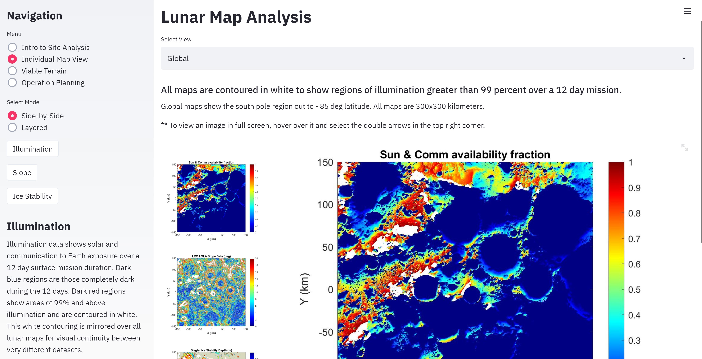

# CMU Interactive Data Science Final Project

* **Online URL**: https://share.streamlit.io/cmu-ids-2020/fp-sweetpotato/main/main.py
* **Team members**:
  * Contact person: lschweit@andrew.cmu.edu
* **Track**: Interactive Visualization/Application (one of Narrative, Model, or Interactive Visualization/Application)

## Abstract

Site analysis is the process of understanding a planetary environment in order to prepare for a space mission. This analysis is conducted for both human and rover space exploration with the goals of understanding three core concepts --(a)  system capabilities for both rover/humans and lander, (b) science objectives, and (c) surrounding environmental conditions. Understanding a given site allows a mission to develop a more detailed Concept of Operations (CONOPs), specify surface operations, and design the rover or human exploration system around the environmental considerations that come with the environment during operations. While many existing applications exist to aid this process, dataset resolution is limited, some are non-intuitive, there are no or limited capabilities to configure and understand what terrain is rovable, and all lack a platform for surface operations development. This application, focusing on lunar polar rover exploration and attempts to incorporate some of these missing pieces to the puzzle.

**Final Report**: https://drive.google.com/file/d/1I0JLB-z5FW8pXpIuYDSkjBbEP8csMjxL/view?usp=sharing

**Video**: https://drive.google.com/file/d/1BcYRp0QzgqZUDW8LEXV5BtgjEklPzGR1/view?usp=sharing

## Running Instructions

To run this application, install and import all dependencies listed in “requirements.txt.” All datasets used are preprocessed and images of the relevant data are included in the “images” folder. This is all you will need to run the application locally.

To run the application follow the below procedures:
*   Download the “images” folder and all .py files
*   Store in a folder of your choice
*   Open a command prompt and locate to the folder in which all materials are stored
*   In the command prompt, type “streamlit run main.py”

The above instructions should result in a web link opening in your browser.

## Work distribution

As a solo project-dooer, Lydia Schweitzer completed this work on her own. She processed datasets using Matlab, designed the intention and configuration of the web application, and documented all work.

### Final deliverables

- [ ] All code for the project should be in the repo.
- [ ] A 5 minute video demonstration.
- [ ] Update Readme according to Canvas instructions.
- [ ] A detailed project report. The contact should submit the video and report as a PDF on Canvas.
