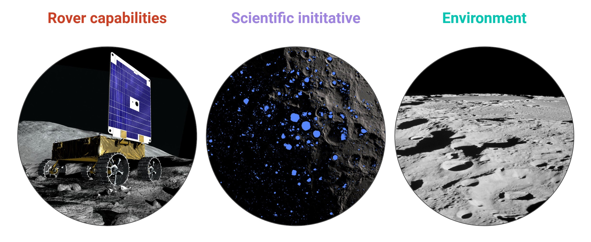
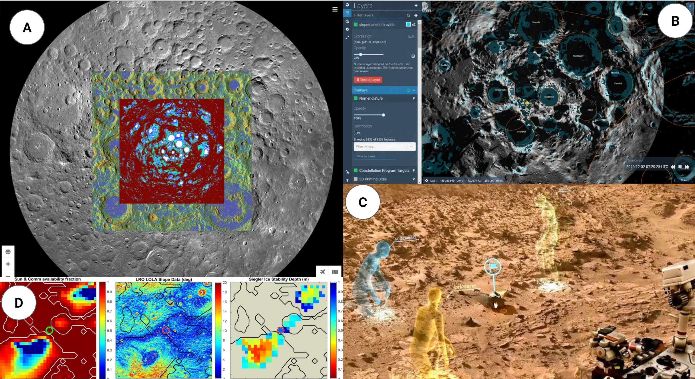

# Lunar Polar Site Analysis

# 01 Introduction

**Problem**

Historically, rover space missions have been funded and developed end-to-end by large organizations. However, within the past few years, NASA has opened up opportunities for space exploration to smaller private groups through a proposal/acceptance pipeline. Many of these more local missions, while supported by NASA or otherwise, still must operate with a much more limited budget in comparison to typical billion-dollar missions. With limited resources, development must be optimized across all fronts. One such front is landing site analysis. Site analysis is critical for mission planning and system design. It typically involves teams of 40+ scientists pouring over multiple lunar datasets with the goal of identifying mission-viable planetary terrain, considering rover capabilities, environmental constraints, and potential science purpose (fig. 1). While some software tools exist with specific strengths, none of them combine an intuitive platform which explains involved datasets, allow for the configuration of viable terrain maps based on mission-specific parameters, and allow mechanisms for surface operation development.

Within the context of lower-resource missions, how can a smaller team of mission developers or even a single individual perform adequate and successful site analysis?

**Motivation**

Within Carnegie Mellon there exist a few space missions. One, MoonRanger, is sending a micro-rover to the lunar south pole in December 2022. I lead MoonRanger’s Mission Operations team, a team whose goal is to design the mission in all aspects. My focus is site selection and surface operations development. In my experience doing this, many software tools have fallen short due to low resolution datasets, limited analysis functionality, and full lack of support for surface operations development. A tool meeting these needs would be highly beneficial for this mission, but also for other missions with more limited resources unlike the typical gargantuan NASA space missions.

# 02 Related Work

Quite a few software tools exist supporting lunar site analysis. The table below details a list of these. The most relevant works are detailed further in the following paragraphs.

<table>
  <tr>
   <td><strong>Software</strong>
   </td>
   <td><strong>SIM</strong>
   </td>
   <td><strong>DEM</strong>
   </td>
   <td><strong>Data Analysis</strong>
   </td>
   <td><strong>Personalized</strong>
   </td>
   <td><strong>Available</strong>
   </td>
  </tr>
  <tr>
   <td>MATLAB
   </td>
   <td>✖
   </td>
   <td>✖
   </td>
   <td>✔
   </td>
   <td>✔
   </td>
   <td>✔
   </td>
  </tr>
  <tr>
   <td>MoonTrek
   </td>
   <td>✖
   </td>
   <td>✖
   </td>
   <td>✔
   </td>
   <td>✖
   </td>
   <td>✔
   </td>
  </tr>
  <tr>
   <td>Gazebo
   </td>
   <td>✔
   </td>
   <td>✖
   </td>
   <td>✖
   </td>
   <td>✔
   </td>
   <td>✔
   </td>
  </tr>
  <tr>
   <td>LunaRay
   </td>
   <td>✔
   </td>
   <td>✖
   </td>
   <td>✖
   </td>
   <td>✔
   </td>
   <td><strong>?</strong>
   </td>
  </tr>
  <tr>
   <td>DEMkit
   </td>
   <td>✖
   </td>
   <td>✔
   </td>
   <td>✖
   </td>
   <td>✔
   </td>
   <td><strong>?</strong>
   </td>
  </tr>
  <tr>
   <td>Lunar Polar Sim
   </td>
   <td>✔
   </td>
   <td>✖
   </td>
   <td>✔
   </td>
   <td>✔
   </td>
   <td><strong>?</strong>
   </td>
  </tr>
  <tr>
   <td>Mars OnSight
   </td>
   <td>✖
   </td>
   <td>✔
   </td>
   <td>✖
   </td>
   <td>✖
   </td>
   <td><strong> ~ </strong>✔
   </td>
  </tr>
</table>

**Table 1. Table of existing software used in space mission contexts and their capabilities**

Table 1 lists multiple existing software tools and their capabilities to simulation the lunar environment (SIM), interact with a key data product - a digital elevation model (DEM), perform data analysis, allow for personalization (i.e. open source), and whether or not they are available for public. These each have their advantages, but none present a high fidelity capacity to address key surface operation analysis -- the ability to define and configure viable terrain maps for path planning purposes or to draw on specific surface operations.

**Figure 2. Related work. A) Moontrek interface with ice stability data layered on top of slope data. B) Quickmap viewing crater names and Permanently Shadowed Regions. C) Mars OnSight. D) Lunar maps processed and visualized using Matlab.**

**MoonTrek** (fig. 2A) and **Quickmap** (fig 2B), are kind of like the photoshop of the space world, allowing a user to select a broad region of the Moon (north pole, south pole, equatorial region) and view datasets in 2D that are available in those locations. Resolution is low, and although opacity can be adjusted, it can be hard to understand the correlation between information. Datasets are selected as layers and cannot be combined for the purpose of constructing a viable terrain map.

**Mars OnSight** (fig. 2C) is a virtual reality environment constructed from stereo images collected by the Mars Curiosity rover. In this environment, scientists and mission personnel can enter and explore the environment. Interesting features can be tagged and some limited data can be associated with certain artefacts. This is only used, however, during the live surface operations of the rover and not during critical planning stages prior to launch. Full datasets of the environment cannot be viewed.

Finally, **Matlab** (fig. 2D) is a software commonly used within the math and engineering communities. This software program allows for extensive data analysis, but is not intuitive or easy to use for those unfamiliar.

The goals of this project are to leverage some existing successful capabilities of the aforementioned works and develop new functionality that fills the critical gaps of site analysis and surface operations planning.

# 03 Methods

The core purpose of this application is to allow a platform for those conducting mission development procedures to. Goals are as follows:
1. To facilitate the understanding of lunar datasets individually, their significance, and how they were collected in some capacity. 
2. To present a mechanism for global planning, the process of identifying viable or rovable terrain at a given site and understanding how risk levels and design implications could affect the resulting viability.
3. To allow mission planners to identify areas of interest within datasets interactively in a hands-on manner and to design surface operations around the parameters specific to each map.

**In order to achieve these goals, careful choice of datasets is imperative.**

The primary considerations of site analysis for a lunar rover mission are (a) mobility, or how well a rover can drive on terrain of various slopes and over obstacles of varying heights, (b) power and thermal, both very closely tied, specifically solar power and component or rover system temperature limits, and (c) scientific initiative. Three datasets fit each of these considerations. Elevation data (in the form of slopes) provides a context for analyzing rover mobility (a). This dataset, from the [Planetary Data Sciences Node](https://pds-geosciences.wustl.edu/lro/lro-l-lola-3-rdr-v1/lrolol_1xxx/data/lola_gdr/polar/jp2/#), is interpolated for slopes using Matlab. The same dataset is combined with a model of solar and Earth elevation with respect to the lunar south pole for a 12 day mission at a given time (Dec 2022). The resulting illumination over time dataset allows users to understand which areas support a mission’s given thermal and power systems (b). Water is considered one of the most valuable resources of the solar system, being a substance which can provide oxygen for breathing, water for hydrating humans, plants, or otherwise, and hydrogen for fuel into the rest of space. Therefore, Siegler Ice Stability at Depth data, from [MoonTrek](https://trek.nasa.gov/moon/#v=0.1&x=0&y=0&z=1&p=urn%3Aogc%3Adef%3Acrs%3AIAU2000%3A%3A30120&d=&locale=&b=moon&e=-4109737.499999994%2C-2155471.6992187467%2C4109737.499999994%2C2155471.6992187467&sfz=&w=), is the third dataset. This data is manually produced by Matt Siegler at NASA Ames Research Center. The dataset predicts regions which could support stable ice, or ice which reliably exists in a given place over time versus ice which sublimates due to solar illumination, by modeling temperature over time. was downloaded. No ground truth data proving the existence of ice at the lunar south pole yet exists, so this dataset is one of the best models.

Datasets are preprocessed in Matlab, which excels at manipulating very large datasets (up to 36000x36000 pixels). Elevation data was interpolated for slope. Illumination data was pre-constructed. Ice Stability at Depth data was filtered to only show stable ice within 1m of the lunar surface, according to the capabilities of existing hydrogenous volatile measuring scientific instruments. Images of each individual datasets are saved as .jpg files from a global and local perspective. The global perspective allows users to understand data implications at a high level and local maps allow users to zero in on an example landing site to analyze in further detail. Data processing was attempted in python to avoid the use of purely displayed images in streamlit, but the size of the data resulted in very high processing times (~15 min) and streamlit’s process for viewing a map dataset such as this (streamlit.plot() function) creates an image of the map first before displaying, which kills the point of processing in python altogether. It also errored with such a large dataset during this process.

Viable maps for slope and illumination are constructed also in Matlab by setting a threshold limit, treating all values above (or below in the case of the dataset) as viable and all those below as completely not-viable. Values within the viable range are scaled from 0 to 1, where 0 is least desirable and 1 is most desirable. A combined viable map is generated by multiplying each the viable slope and illumination maps together. 

streamlit_drawable_canvas played a valuable role in a tab dedicated to surface operations development. 

# 04 Results

The resulting application consists of four tabs.

**Tab 1: Intro to Site Analysis**
This tab explains site analysis - what it is, how it’s done and how it benefits mission development. This tab also introduces the other tabs and their individual functionality.

**Tab 2: Individual Map View**
This tab allows users to view side by side maps or layered maps either local or global. The **side-by-side** view displays maps individually. Users can interactively click on each map in the sidebar and view an enlarged version. A description pops up in the sidebar describing the dataset - it’s resolution, what it means, and in some cases how it was collected. The **layered view** allows users to layer each map and adjust the opacity between each to begin drawing parallels between various map parameters and conditions.

**Tab 3: Viable Terrain**
This tab lets users identify regions which are rovable and those which are not rovable, given their mission’s specific parameters specific to slope and illumination maps. Users can select different degrees of risk for each map and observe the local and global implications of viable terrain.

**Tab 4: Operation Planning**
This tab leverages each local individual map as a canvas, selectable by a user, on which to draw. Users can select waypoints of interest for their science purpose and evaluate whether or not those waypoints fit their illumination and slope capabilities. Users can draw on landing ellipses using the circle tool, outline regions of interest with the rectangle tool, indicate rover traverse paths using the line tool, or freedraw as they like. Each object drawn can be resized and moved around within the canvas. Users can also adjust the opacity of the background map to focus more on the map or more on their diagrams. Diagrams are shown below the canvas on their own and can be saved by right clicking.

# 05 Discussion

Through the use of this application, users learn about the site analysis process, the criteria for evaluation - rover capabilities, environmental constraints, and scientific initiative, and how  site analysis benefits mission development. They learn about three key maps used for such site analysis, the resolution of the data, and what instruments were used for data collection. 

This system has enabled intuitive user configuration of viable terrain maps, a feature which can also be used to understand how increasing the fidelity of aspects of the rover system design can affect the scope of rovable terrain. Such a capability can be used both in early on mission development before a solidified rover configuration has been defined as well as later on during, say, the global planning process. 

The system also provides a platform for dataset-and-drawing-integrated surface operations development, something lacking in all existing site analysis tools.

# 06 Future Work
The future of this work could involve the integration of more datasets, for instance datasets of permanently shadowed regions or temperature profiles at the south pole. It could allow users to all lunar regions (south pole, north pole, and equatorial regions) or could even be extended to include different planets, prioritized by those most within the reach of current space exploration trends and technological capabilities for rover exploration. It could investigate further the means by which users could interact directly with the datasets themselves versus images. The Viable Terrain tab could include more variable risk levels for both slope and illumination and could include some way to overlay science specific datasets. The Operation Planning tab could allow users to number or label the marks they make, save multiple diagrams, and view other maps as background images.

